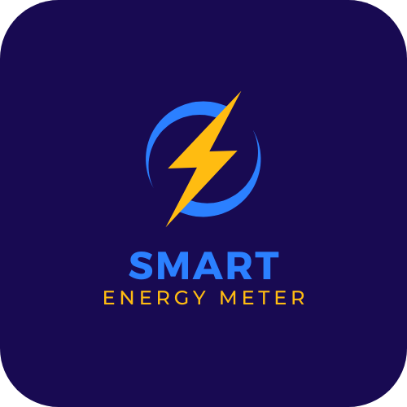
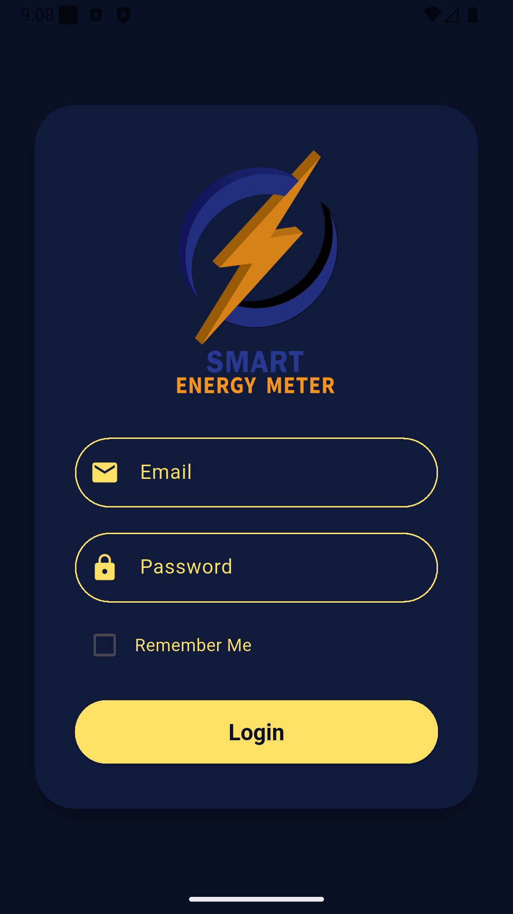
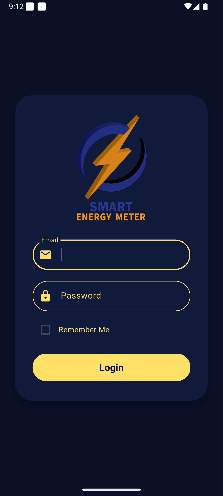
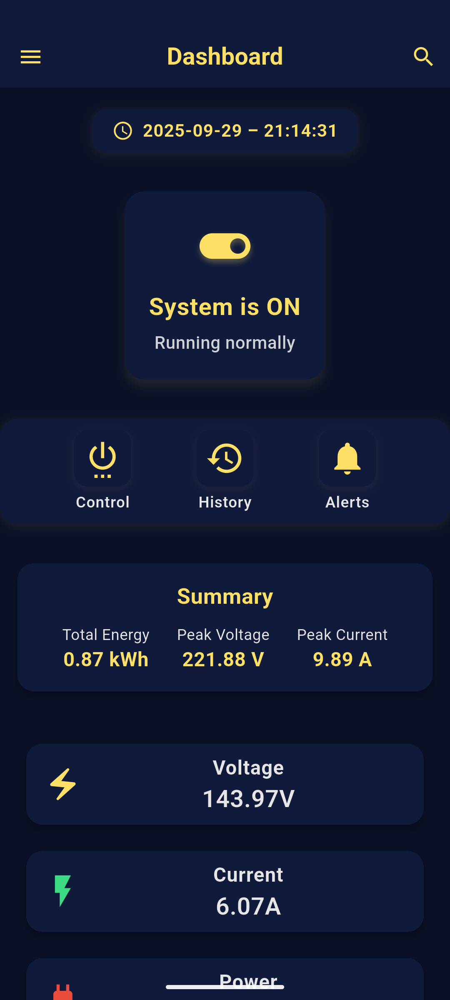

<div align="center">

# ⚡ Smart Energy Meter - Web Application



### Monitor, Analyze, and Optimize Your Energy Consumption

[](https://reactjs.org/)
[](https://nodejs.org/)
[](LICENSE)
[](CONTRIBUTING.md)

[](https://vercel.com)
[](https://firebase.google.com/)
[](https://github.com/gmpsankalpa/FYP-web)

[🌐 Live Demo](https://your-demo-url.vercel.app) • [📱 Download App](https://github.com/gmpsankalpa/smart_energy_meter/releases) • [📖 Documentation](RELEASE_GUIDE.md) • [🐛 Report Bug](https://github.com/gmpsankalpa/FYP-web/issues) • [💡 Request Feature](https://github.com/gmpsankalpa/FYP-web/issues)

</div>

---

## 📋 Table of Contents

- [About The Project](#-about-the-project)
- [Key Features](#-key-features)
- [Technology Stack](#-technology-stack)
- [Getting Started](#-getting-started)
  - [Prerequisites](#prerequisites)
  - [Installation](#installation)
  - [Development](#development)
- [Project Structure](#-project-structure)
- [Auto-Update Features](#-auto-update-features)
- [Available Scripts](#-available-scripts)
- [Deployment](#-deployment)
- [Contributing](#-contributing)
- [Documentation](#-documentation)
- [License](#-license)
- [Contact](#-contact)
- [Acknowledgments](#-acknowledgments)

---

## 🎯 About The Project

**Smart Energy Meter** is a comprehensive web application designed to revolutionize energy monitoring and management. Built with React 19.2.0 and modern web technologies, it provides real-time insights into energy consumption patterns, helping users make informed decisions to reduce costs and environmental impact.

### 🌟 Why Smart Energy Meter?

- **Real-Time Monitoring**: Track energy usage as it happens
- **Data-Driven Insights**: Visualize consumption patterns with interactive charts
- **Cost Optimization**: Identify opportunities to reduce energy bills
- **Automated Updates**: GitHub-integrated changelog and release management
- **Mobile-First Design**: Responsive across all devices
- **User-Friendly**: Intuitive interface designed for everyone

<div align="center">

### 📸 Screenshots

<table>
  <tr>
    <td></td>
    <td></td>
    <td></td>
  </tr>
  <tr>
    <td align="center"><b>Dashboard</b></td>
    <td align="center"><b>Analytics</b></td>
    <td align="center"><b>Real-Time Monitoring</b></td>
  </tr>
</table>

</div>

---

## ✨ Key Features

### 🚀 Core Functionality

- ⚡ **Real-Time Energy Monitoring**
  - Live energy consumption tracking
  - Instant notifications for anomalies
  - Multi-device support

- 📊 **Advanced Analytics**
  - Interactive charts and graphs
  - Historical data analysis
  - Predictive consumption patterns
  - Export data for further analysis

- 🔒 **Security & Theft Detection**
  - Tampering detection algorithms
  - Unauthorized usage alerts
  - Secure data encryption

- 📱 **Mobile Application**
  - Native Android app with full features
  - iOS app coming soon (Q1 2026)
  - Progressive Web App (PWA) support

### 🎨 User Experience

- 🌓 **Dark/Light Mode** - Adaptive theme system
- 📱 **Responsive Design** - Works on all screen sizes
- ♿ **Accessibility** - WCAG 2.1 compliant
- 🌐 **Multi-Language** - Coming soon
- ⚡ **Fast Performance** - Optimized loading times

### 🤖 Automation Features

- 🔄 **Auto-Update System**
  - Automatic changelog from GitHub releases
  - Android app auto-update on Download page
  - Website changelog auto-generation
  - Smart refresh without page reload

- 📦 **GitHub Integration**
  - Fetches releases from 2 repositories
  - Automatic version detection
  - APK size calculation
  - Release notes parsing

---

## 🛠️ Technology Stack

### Frontend


### Backend & Services


### Tools & Libraries


### Development Tools

- **Create React App** - Project bootstrapping
- **ESLint** - Code linting
- **CSS Modules** - Scoped styling
- **React Hooks** - State management
- **Custom Hooks** - Reusable logic

---

## 🚀 Getting Started

### Prerequisites

Before you begin, ensure you have the following installed:

- **Node.js** (version 18.x or higher)
  ```bash
  node --version  # Should be v18.x or higher
  ```

- **npm** (comes with Node.js)
  ```bash
  npm --version  # Should be 8.x or higher
  ```

- **Git**
  ```bash
  git --version
  ```

### Installation

1. **Clone the repository**
   ```bash
   git clone https://github.com/gmpsankalpa/FYRP-Website.git
   cd FYP-web
   ```

2. **Install dependencies**
   ```bash
   npm install
   ```

3. **Configure Firebase** (Optional)
   
   Create a `.env` file in the root directory:
   ```env
   REACT_APP_FIREBASE_API_KEY=your_api_key
   REACT_APP_FIREBASE_AUTH_DOMAIN=your_auth_domain
   REACT_APP_FIREBASE_PROJECT_ID=your_project_id
   REACT_APP_FIREBASE_STORAGE_BUCKET=your_storage_bucket
   REACT_APP_FIREBASE_MESSAGING_SENDER_ID=your_sender_id
   REACT_APP_FIREBASE_APP_ID=your_app_id
   ```

4. **Start the development server**
   ```bash
   npm start
   ```

5. **Open your browser**
   
   Navigate to [http://localhost:3000](http://localhost:3000)

---

## 📁 Project Structure

```
fyrp-web/
├── public/
│   ├── index.html              # Main HTML file
│   ├── manifest.json           # PWA manifest
│   └── robots.txt              # SEO robots file
│
├── src/
│   ├── assets/
│   │   ├── app/                # App-related assets
│   │   └── img/                # Images and screenshots
│   │
│   ├── components/
│   │   ├── Footer.jsx          # Footer component
│   │   ├── Footer.module.css
│   │   ├── Navigation.jsx      # Navigation component
│   │   └── Navigation.module.css
│   │
│   ├── config/
│   │   └── firebase.js         # Firebase configuration
│   │
│   ├── pages/
│   │   ├── Home.jsx            # Home page
│   │   ├── About.jsx           # About page
│   │   ├── Download.jsx        # Download page (auto-update)
│   │   ├── ChangeLog.jsx       # ChangeLog page (auto-update)
│   │   ├── Contact.jsx         # Contact page
│   │   ├── Dashboard.jsx       # Dashboard page
│   │   ├── Login.jsx           # Login page
│   │   └── Error404.jsx        # 404 error page
│   │
│   ├── hooks/
│   │   └── usePageTitle.js     # Custom hook for page titles
│   │
│   ├── App.js                  # Main App component
│   ├── App.css                 # Global styles
│   └── index.js                # Entry point
│
├── .env                        # Environment variables
├── package.json                # Project dependencies
├── vercel.json                 # Vercel deployment config
├── README.md                   # This file
└── RELEASE_GUIDE.md           # Release notes guide
```

---

## 🔄 Auto-Update Features

This project includes **three major automation features** that integrate with GitHub releases:

### 1. 📱 Download Page - App Changelog

**Repository:** [smart_energy_meter](https://github.com/gmpsankalpa/smart_energy_meter)

- Automatically fetches app releases
- Updates Android Download Card (version, size, date, download URL)
- Displays app changelog with release notes
- Smart refresh without page reload

### 2. 🌐 ChangeLog Page - Website Releases

**Repository:** [FYP-web](https://github.com/gmpsankalpa/FYRP-Website)

- Fetches website releases automatically
- Categorizes changes (Added, Improved, Changed, Fixed)
- Detects release types (Major, Minor, Patch)
- Interactive timeline with statistics

### 3. 🔄 Smart Refresh System

- Loading spinners during fetch
- Error handling with fallback data
- Disabled states to prevent spam clicking
- Visual feedback for all async operations

**📖 For detailed release note formatting, see [RELEASE_GUIDE.md](RELEASE_GUIDE.md)**

---

## 📜 Available Scripts

In the project directory, you can run:

### `npm start`

Runs the app in **development mode**.

- Opens [http://localhost:3000](http://localhost:3000)
- Hot reload on file changes
- Shows lint errors in console

### `npm test`

Launches the **test runner** in interactive watch mode.

- Run all tests
- Watch for changes
- Coverage reporting

### `npm run build`

Builds the app for **production** to the `build` folder.

- Optimized React production build
- Minified files with hashes
- Ready for deployment

**Output:**
```
build/
├── static/
│   ├── css/
│   ├── js/
│   └── media/
├── index.html
└── manifest.json
```

### `npm run eject`

⚠️ **Warning: This is a one-way operation!**

Ejects from Create React App, giving full control over configuration files.

**Note:** Only use if you need custom webpack/Babel configuration.

---

## 🌐 Deployment

### Deploy to Vercel (Recommended)

1. **Install Vercel CLI**
   ```bash
   npm install -g vercel
   ```

2. **Login to Vercel**
   ```bash
   vercel login
   ```

3. **Deploy**
   ```bash
   vercel
   ```

4. **Production Deployment**
   ```bash
   vercel --prod
   ```

### Deploy to Netlify

1. **Build the project**
   ```bash
   npm run build
   ```

2. **Deploy via Netlify CLI**
   ```bash
   npm install -g netlify-cli
   netlify deploy --prod --dir=build
   ```

### Deploy to GitHub Pages

1. **Install gh-pages**
   ```bash
   npm install gh-pages --save-dev
   ```

2. **Add to package.json**
   ```json
   "homepage": "https://gmpsankalpa.github.io/FYRP-Website",
   "scripts": {
     "predeploy": "npm run build",
     "deploy": "gh-pages -d build"
   }
   ```

3. **Deploy**
   ```bash
   npm run deploy
   ```

---

## 🤝 Contributing

Contributions are what make the open-source community such an amazing place to learn, inspire, and create. Any contributions you make are **greatly appreciated**!

### How to Contribute

1. **Fork the Project**
   ```bash
   # Click the 'Fork' button on GitHub
   ```

2. **Clone your Fork**
   ```bash
   git clone https://github.com/YOUR_USERNAME/FYRP-Website.git
   cd FYRP-Website
   ```

3. **Create a Feature Branch**
   ```bash
   git checkout -b feature/AmazingFeature
   ```

4. **Make Changes and Commit**
   ```bash
   git add .
   git commit -m "Add some AmazingFeature"
   ```

5. **Push to your Fork**
   ```bash
   git push origin feature/AmazingFeature
   ```

6. **Open a Pull Request**
   - Go to the original repository
   - Click "New Pull Request"
   - Select your feature branch
   - Submit for review

### Contribution Guidelines

- Follow the existing code style
- Write clear commit messages
- Add tests for new features
- Update documentation as needed
- Ensure all tests pass before submitting

### Code of Conduct

- Be respectful and inclusive
- Provide constructive feedback
- Focus on what is best for the community
- Show empathy towards others

---

## 📚 Documentation

### Main Documentation

- **[RELEASE_GUIDE.md](RELEASE_GUIDE.md)** - How to create releases for GitHub auto-updates
- **[ANDROID_CARD_AUTO_UPDATE.md](ANDROID_CARD_AUTO_UPDATE.md)** - Android card auto-update details
- **[CHANGELOG_AUTO_UPDATE.md](CHANGELOG_AUTO_UPDATE.md)** - ChangeLog page auto-update guide
- **[AUTO_UPDATE_COMPLETE_SUMMARY.md](AUTO_UPDATE_COMPLETE_SUMMARY.md)** - Complete automation summary

### Additional Resources

- **[Create React App Documentation](https://facebook.github.io/create-react-app/docs/getting-started)**
- **[React Documentation](https://reactjs.org/)**
- **[Firebase Documentation](https://firebase.google.com/docs)**
- **[Vercel Documentation](https://vercel.com/docs)**

### API Documentation

- **[GitHub REST API](https://docs.github.com/en/rest)** - Used for release fetching
- **[Font Awesome Icons](https://fontawesome.com/icons)** - Icon library reference

---

## 📄 License

Distributed under the **MIT License**. See `LICENSE` for more information.

```
MIT License

Copyright (c) 2025 G.M.P. Sankalpa

Permission is hereby granted, free of charge, to any person obtaining a copy
of this software and associated documentation files (the "Software"), to deal
in the Software without restriction, including without limitation the rights
to use, copy, modify, merge, publish, distribute, sublicense, and/or sell
copies of the Software, and to permit persons to whom the Software is
furnished to do so, subject to the following conditions:

The above copyright notice and this permission notice shall be included in all
copies or substantial portions of the Software.
```

---

## 📞 Contact

**G.M.P. Sankalpa**

[](https://github.com/gmpsankalpa)
[](https://linkedin.com/in/gmpsankalpa)
[](mailto:sankalpagunathilaka@gmail.com)

**Project Links:**

- **Website Repository:** [https://github.com/gmpsankalpa/FYRP-Website](https://github.com/gmpsankalpa/FYRP-Website)
- **App Repository:** [https://github.com/gmpsankalpa/smart_energy_meter](https://github.com/gmpsankalpa/smart_energy_meter)
- **Live Demo:** [Your Vercel URL]
- **Documentation:** [Wiki](https://github.com/gmpsankalpa/FYRP-Website/wiki)

---

## 🙏 Acknowledgments

Special thanks to:

- **[Create React App](https://create-react-app.dev/)** - For the amazing starter template
- **[React Team](https://reactjs.org/)** - For the incredible framework
- **[Font Awesome](https://fontawesome.com/)** - For beautiful icons
- **[GitHub](https://github.com/)** - For hosting and API services
- **[Vercel](https://vercel.com/)** - For seamless deployment
- **[Firebase](https://firebase.google.com/)** - For backend services
- **Open Source Community** - For inspiration and support

### Built With ❤️ by the Smart Energy Meter Team

---

## 📊 Project Status


---

## 🎯 Roadmap

- [x] Core website functionality
- [x] GitHub auto-update integration
- [x] Android app release
- [x] Smart refresh system
- [x] Responsive design
- [ ] iOS app release (Q1 2026)
- [ ] Multi-language support
- [ ] Advanced analytics dashboard
- [ ] API documentation
- [ ] Plugin system

---

## 💡 Support

If you find this project helpful, please consider:

- ⭐ **Starring the repository** on GitHub
- 🐛 **Reporting bugs** via [Issues](https://github.com/gmpsankalpa/FYRP-Website/issues)
- 💡 **Suggesting features** via [Discussions](https://github.com/gmpsankalpa/FYRP-Website/discussions)
- 📖 **Improving documentation**
- 🤝 **Contributing code**

---

<div align="center">

### 🌟 Star History

[](https://star-history.com/#gmpsankalpa/FYRP-Website&Date)

---

**Made with ❤️ and ⚡ by the Smart Energy Meter Team**

[](#-smart-energy-meter---web-application)

</div>
